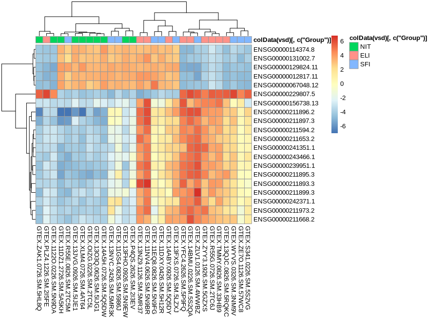

Repositorio en github: <https://github.com/ffer200395/RNA-seq.git>
```{r setup, include=FALSE}
library(knitr)
knitr::opts_chunk$set(echo = F, eval = FALSE)
```

# Abstract
Una de las tareas básicas en el análisis de datos de conteos procedentes de secuenciación de ARN (ARN-seq) es la detección de genes diferencialmente expresados. 

Una cuestión de gran relevancia en el análisis es la cuantificación e inferencia estadística de cambios sistemáticos entre condiciones frente a la variabilidad entre las muestras bajo una misma condición.

# Objetivos
En este estudio se muestra una propuesta del workflow de análisis para la identificación de genes diferencialmente expresados entre tejidos del tiroides que han recibido 3 tipos de infiltración.

El objetivo de este estudio es doble ya que:

- Primero se realiza una exploración inicial de los datos (EDA) a fin de evaluar la calidad de los mismos y explorar las relaciones entre muestras.

- Posteriormente se realiza un análisis de expresión génica diferencial que nos permita explorar los resultados visualmente.

# Materiales y Métodos

## Naturaleza de los datos y experimento
Partimos de los archivos counts.csv y targets.csv:

- El archivo **counts.csv** contiene los datos de conteo procedentes de secuenciación de ARN (ARN-seq) de tejidos del tiroides. Estos datos están conformados por una tabla que nos indica, para cada muestra (columna) el número de fragmentos secuenciados que han sido asignados a cada gen (fila). Inicialmente son 292 muestras y 56202 genes.

- El archivo **targets.csv** contiene información sobre cada muestra del experimento en formato tabla. Cada una de las filas representa la información acerca de una muestra, es por ello que el número de filas de esta tabla coincide con el número de columnas de la tabla proveniente del archivo counts.csv. Las columnas de la tabla target representan: el identificador de cada muestra, tipo de experimento, de que parte del cuerpo proviene el tejido, el sexo del sujeto del que fue extraída la muestra así como el grupo experimental al que pertenece la misma.

En la columna Group de la tabla targets se especifica el **grupo experimental** al que pertenece cada muestra, estos son:

  - Not infiltrated tissues (**NIT**).
  - Small focal infiltrates (**SFI**).
  - Extensive lymphoid infiltrates (**ELI**).
  
Se realizan **3 comparaciones** de la expresión génica **entre** los **grupos** experimentales, estas son:

  - Muestras del grupo NIT frente a las muestras del grupo SFI.
  - Muestras del grupo NIT frente a las del grupo ELI.
  - Muestras del grupo SFI frente a las del grupo ELI.
  
## Métodos y herramientas
  
El paquete **DESeq2** de **Bioconductor** nos provee de métodos que permiten testear la expresión génica diferencial. Además el paquete **GOstats** nos permite realizar un análisis de la significación biológica de los genes que han sido identificados con diferencialmente expresados entre los grupos.

Para la visualización se usan funciones del paquee **ggplot2** y funciones propias del paquete base de R.

Los **pasos** que se han seguido para realizar el análisis son:

  - Carga de los datos y selección del subconjunto de análisis.
  - Creación del objeto DESeq.
  - Filtro básico.
  - Normalización y estabilización de la varianza.
  - Exploración inicial de los datos (Diagrama de cajas, clúster jerárquico y PCA).
  - Identificación de los genes que se expresan diferencialmente:
    + Ejecución del modelo DESeq.
    + Contrastes entre grupos.
    + Selección de los genes más significativos.
    + Visualización mediante counts plots e histogramas de los p-valores.
    
  - Anotación de los genes diferencialmente expresados.
  - Patrones de expresión y comparación de comparaciones (diagrama de Venn, mapas de calor, volcano plots).
  - Análisis de significación biológica.

## Descripción cualitativa del análisis

### Carga de los datos y selección del subconjunto de análisis

Cargamos los archivos counts.csv y targets.csv. Estos representan a un total de 292 muestras (236 del grupo NIT, 42 de SFI y 14 de ELI). A fin de reducir la carga computacional se seleccionan 10 muestras aleatorias de cada grupo, por lo que nuesto análisis se basará en el estudio sobre 30 muestras. La siguiente sentencia muestra cómo se seleccionaron:
```{r echo=TRUE}
my.targets <- targets %>% group_by(Group) %>% sample_n(10)
```

Una vez seleccionadas las muestras de targets se filtran las columnas de la tabla counts para tener solamente los datos de conteo de las muestras seleccionadas. Posteriormente se modifica la columna Group de targets para que sea de tipo "factor" y el grupo NIT sea el grupo de referencia (el no tratado).

Finalmente podemos crear el objeto DESeqDataSet a partir de nuestra tabla targets y counts:
```{r echo=TRUE}
dds <- DESeqDataSetFromMatrix(countData = my.counts, colData = my.targets, design = ~ Group)
```

Este objeto será usado para los análisis posteriores.

### Filtro, normalización y estabilización de la varianza

Eliminamos de nuestro dataset aquellos genes que no se expresen o que apenas lo hagan por ello nos quedamos con aquellos cuya suma total de secuencias detectadas entre muestras sea mayor a 10. Pasamos de un total de 56.202 genes a 35.942.

Aplicamos diferentes métodos que nos permitan estabilizar la varianza y hacer las muestras comparables entre sí. Estos son: log2 normalized counts, regularized los transformation y variance stabilizing transformation. Hemos usado las funciones del paquete DESeq2: rlog, vst y estimatedSizeFactors.

### Exploración inicial de los datos 

Con el diagrama de cajas podemos ver si la distribuciones de nuestros datos son similares (comparables).
 
A través del gráfico de componentes principales se puede obtener una idea de cómo se agrupan las muestras en nuestro dataset así como la varianza existente.

También podemos ver como se agrupan nuestras muestras a través de un clúster jerárquico. De este modo podemos detectar anomalías o si las muestras se agrupan según su grupo experimental.

### Identificación de los genes que se expresan diferencialmente

En este punto ejecutamos el modelo DESeq que nos permitirá obtener resultados acerca de los contrastes entre grupos, por lo que para cada contraste almacenamos su correspondiente resultado en una variable con la que vamos a poder trabajar posteriormente. 

Para cada uno de los contrastes filtramos los genes tomando como referencia el p-valor ajustado obtenido. Si aceptamos un 10% de falsos positivos entonces los genes con p-val<0.1 son significativos. De este modo para el contraste de los grupos SFI vs NIT existen 1041 genes que son estadísticamente significativos, para el contraste de ELI vs NIT 5001 genes y para ELI vs SFI 897 genes. 
La función plotCounts del paquete DESeq2 nos permite ver para un gen determinado cual ha sido el conteo por muestras de cada grupo. 
Realizando un histograma de p-valores de los contrastes podemos tener una idea de como se distribuye el nivel de significación de los genes implicados en el contraste así como el número de genes por cada p-valor.

### Anotación de los genes diferencialmente expresados

Hacemos uso del paquete de anotación de datos org.Hs.eg.db de Bioconductor el cual nos permite mapear los genes a través de su identificador Ensembl para añadir su símbolo y su identificador Entrez. La siguiente función aplica ese proceso a los resultados de un contraste y los devuelve dejando solo aqullos genes para los que sí se pudo realizar la anotación:

```{r echo=TRUE}
my.annotation <- function(data){
  claves <- substr(rownames(data), 1, 15)
  data$symbol <- mapIds(org.Hs.eg.db, keys=claves, column="SYMBOL", keytype="ENSEMBL", multiVals="first")
  data$entrez <- mapIds(org.Hs.eg.db, keys=claves, column="ENTREZID", keytype="ENSEMBL", multiVals="first")
  return(data[complete.cases(data), ])
}
```

De este modo para caa contraste pasamos a tener: 856 para SFI vs NIT, 4009 para ELI vs NIT y 745 para ELI vs SFI.

### Patrones de expresión y comparación de comparaciones 

A través de diagramas de Venn podemos ver el número de genes que se expresan diferencialmente por cada contraste y entre múltiples contrastes.

Los Volcano plots nos permiten ver aquellos genes que son estadísticamente significativos y que tienen un alto/bajo fold change (biológicamente significativos) ya que para contruir este gráfico se toma log2FoldChange como eje X y -log10(padj) como eje Y. De ese modo los genes que están up-regulated aparecerán en el margen superior derecho (alto fold change y p-valor bajo) y los genes que están down-regulated aparecerán en el margen superior izquierdo (bajo fold change y p-valor bajo).

Con el mapa de calor podemos observar que genes se muestran up/down regulados entre las muestras y grupos experimentales pudiendo identificar perfiles de expresión. Para generar el mapa de calor se usan los 20 genes que mayor conteo (normalizado) y la función pheatmap del paquete pheatmap.

### Análisis de significación biológica

Tras la obtención de los genes diferencialmente expresados se procede con el enriquecimiento de los datos usando la base de datos de anotaciones "Gene Ontology" de modo que se puedan identificar grupos de genes relacionados con procesos biológicos o funciones moleculares. Los resultados del análisis GO se exportan en un documento html.

Por último se muestran los 10 términos más frecuentes que aparecen tras realizar el análisis GO.

# Resultados

## EDA

Diagramas de cajas que muestran la distribución de los conteos entre las muestras sin normalizar y aplicando diferentes técnicas de normalizado y reducción de la varianza:

<center></center>

La técnica "regularized log" hace que todas las muestras sean comparables entre sí y además no se observan outliers.

Gráfico de componentes principales:

<center></center>

Las muestras pertenecientes al grupo NIT muestran menor variabilidad entre si de los que las muestras de los grupos SFI y ELI. Parece existir una distinción entre las muestras según su grupo experimental.

Clúster jerárquico:

<center></center>

Se nos confirma que las muestras del grupo NIT se agrupan entre sí a excepción de una muestra, pero no ocurre lo mismo para el resto de grupos.

## Identificación de GDE y patrones de expresión

Una vez realizados los test de cotrastes podemos visualizar el conteo para un gen en concreto:

<center></center>

En este caso hemos escogido el gen que menor p-valor ajustado ha obtenido en el contraste SFI vs NIT. Se aprecia que para el grupo que no ha recibido la infiltración no se detectaron transcritos de ese gen, en cambio para la mayoría de muestras pertenecientes a los grupos ELI y SFI sí que se obsevan un alto número de conteos.

Mediante un histograma de p-valores ajustados podemos conocer la proporción de genes que se expresan diferencialmente a para cada p-valor ajustado en cada uno de los contrastes realizados:

<center></center>

Claramente se observa que para los contrastes SFI vs NIT y ELI vs NIT casi el 50% de los genes que se expresan diferencialmente tienen asociados un p-valor ajustado inferior a 0.01. En cambio esta situación no se da para el contraste ELI vs SFI lo cual sugiere que el aplicar cualquier tipo de infiltración frente el no aplicarla tiene un efecto en las muestras estadísticamente significativo.

Diagrama de Venn:

<center></center>

Podemos ver que hay 134 genes que se expresan diferencialmente independientemente del tipo de contraste realizado, pero esto no significa que los podamos descartar ya que pueden estar up regulados en algunos contrastes y down regulados en otros.

Volcano plot tomando como umbrales un p-valor de 0.05 y un FC de +-2.5:

<center></center>
<center></center>
<center></center>

En los 3 contrastes la proporcion de genes que está up regulados es mayor a los que están down regulados. Llama la atención que para los contrastes ELI-NIT y SFI-NIT el gen IGLV6-37 sea el que destaque sobre el conjunto de genes que se muestran up regulados.

Mapa de calor de los genes con mayor conteo (normalizado):

<center></center>

En este gráfico podemos ver que existe un conjnunto de genes que se sobreexpresan para los grupos ELI y SFI pero que están down regulados para el grupo NIT (mitad y parte inferior del heatmap). También se observa otro conjunto de genes que se muestran up/down regulados entre muestras y no enre grupos (parte superior del heatmap).

## Significación biológica

El análisis de significación biológica se ha realizado para el contraste ELI-NIT ya que es el que ha mostrado un mayor número de genes diferencialmente expresados (4.009 genes con p-valor ajustado inferior a 0.1). Para realizar el análisis se ha consultado la base de datos GO y un punto de corte del p-valor de 0.001.

Además de exportar el reporte en html se muestras los 10 términos más frecuentes:

<center></center>

# Apéndice

Código utilizado para el análisis:
```{r echo=TRUE}
## --- Paquetes necesarios para el análisis
if (!require(DESeq2))BiocManager::install("DESeq2")
if (!require(GOstats))BiocManager::install("GOstats")
if (!(require(dplyr))) install.packages("dplyr")
if (!require(VennDiagram)) install.packages("VennDiagram")
if (!require(pheatmap)) install.packages("pheatmap")
if (!require(tm)) install.packages("tm")

## --- Cargamos los datos
counts <- read.csv('data/counts.csv', sep = ';', header = T, row.names = 1)
targets <- read.csv('data/targets.csv', sep = ',', header = T)

# --- Creación del subconjunto del análisis (usar datos de expresión RNA-Seq) y preparación de los datos
library(dplyr)
set.seed(1234)
# Elegimos 10 muestras de cada grupo
my.targets <- targets %>% group_by(Group) %>% sample_n(10)

# Modificamos los nombres de las muestras para que sea igual que las columnas de la tabla counts
my.targets$Sample_Name <- gsub('-', '.', my.targets$Sample_Name)

# Filtramos la tabla counts
my.counts <- counts[, my.targets$Sample_Name]

# Los nombres de las filas de Targets deben coincidir con las columnas de Counts
rownames(my.targets) <- my.targets$Sample_Name
sum(colnames(my.counts) == rownames(my.targets))

# Convertimos la variable Group en factor (El grupo no tratado es el de referencia)
my.targets$Group %>% as.factor() %>% relevel('NIT') -> my.targets$Group

# Construimos el objeto DESeqDataSet a partir de Targets y Counts
library(DESeq2)
dds <- DESeqDataSetFromMatrix(countData = my.counts, colData = my.targets, design = ~ Group)

# --- Preprocesado de los datos: filtraje, normalización y estabilización de la varianza

# Nos quedamos con aquellos genes que tengan al menos 10 reads en total
nrow(dds)
dds <- dds[ rowSums(counts(dds)) >= 10, ]
nrow(dds)

# Número de reads por muestra expresado en millones
sort(colSums(my.counts))/1e6

# log2 normalized counts 
log.norm.counts <- log2(counts(estimateSizeFactors(dds), normalized=TRUE) + 1)

# Regularized log transformation
rld <- rlog(dds)

# Variance stabilizing transformation
vsd <- vst(dds)

# --- EDA: Scatter plots, boxplots, cluster y PCA

# Scatter plots
par(mfrow=c(2,2),mar=c(2,2,2,2))
plot(log2(counts(dds)[,1:2] + 1), cex=.1, main = 'Sin normalizar')
plot(log.norm.counts[,1:2], cex=.1, main = 'Log norm')
plot(assay(rld)[,1:2], cex=.1, main = 'Regularized Log')
plot(assay(vsd)[,1:2], cex=.1, main = 'VST')

# Boxplots
par(mfrow=c(2,2),mar=c(2,2,2,2))
boxplot(log2(counts(dds) + 1), names=my.targets$SRA_Sample, las=2, main = 'Sin normalizar')
boxplot(log.norm.counts, names=my.targets$SRA_Sample, las=2, main = 'Log norm')
boxplot(assay(rld), names=my.targets$SRA_Sample, las=2, main = 'Regularized Log')
boxplot(assay(vsd), names=my.targets$SRA_Sample, las=2, main = 'VST')

# Cluster
par(mfrow=c(3,1),mar=c(1,1,1,1))
plot(hclust(dist(t(log.norm.counts))), labels=colData(dds)$Group, main = 'Log norm')
plot(hclust(dist(t(assay(rld)))), labels=colData(rld)$Group, main = 'Regularized Log')
plot(hclust(dist(t(assay(vsd)))), labels=colData(vsd)$Group, main = 'VST')

# PCA
library(ggplot2)
plotPCA(DESeqTransform(SummarizedExperiment(log.norm.counts, colData=colData(dds))), intgroup="Group")+ggtitle('PCA para log2 norm')+theme(plot.title = element_text(hjust = 0.5))
plotPCA(rld, intgroup="Group")+ggtitle('PCA para Rlog')+theme(plot.title = element_text(hjust = 0.5))
plotPCA(vsd, intgroup="Group")+ggtitle('PCA con VST')+theme(plot.title = element_text(hjust = 0.5))

# --- Identificación de genes diferencialmente expresados

# Ejecutamos el modelo DESeq2
dds <- DESeq(dds)

# Hacemos los contrastes entre grupos
res_sfi_nit <- results(dds, contrast=c("Group",'SFI','NIT'))
res_eli_nit <- results(dds, contrast=c("Group",'ELI','NIT'))
res_eli_sfi <- results(dds, contrast=c("Group",'ELI','SFI'))

# Número de genes con p-val ajustado menor de 0.1 
#(Si aceptamos un 10% de falsos positivos entonces los genes con p-val<0.1 son significativos)
sum(res_sfi_nit$padj < 0.1, na.rm=TRUE)
sum(res_eli_nit$padj < 0.1, na.rm=TRUE)
sum(res_eli_sfi$padj < 0.1, na.rm=TRUE)

# Genes más significativos
res_sfi_nit_Sig <- subset(res_sfi_nit, padj < 0.1)
res_eli_nit_Sig <- subset(res_eli_nit, padj < 0.1)
res_eli_sfi_Sig <- subset(res_eli_sfi, padj < 0.1)

# Counts plot para visualizar el conteo para un gen en concreto
plotCounts(dds, gene = rownames(res_sfi_nit_Sig)[which.min(res_sfi_nit_Sig$padj)], intgroup=c("Group"))

# p-val hist
par(mfrow=c(1,3))
hist(res_sfi_nit_Sig$padj, xlab = 'p-val adj.', main = 'Histograma para SFI-NIT', freq=F, ylim = c(0,50))
hist(res_eli_nit_Sig$padj, xlab = 'p-val adj.', main = 'Histograma para ELI-NIT', freq=F, ylim = c(0,50))
hist(res_eli_sfi_Sig$padj, xlab = 'p-val adj.', main = 'Histograma para ELI-SFI', freq=F, ylim = c(0,50))
 
# MA-plot
par(mfrow=c(1,3),mar=c(2,2,2,2))
plotMA(res_sfi_nit, ylim=c(-4,4), main = 'MA plot SFI-NIT')
plotMA(res_eli_nit, ylim=c(-4,4), main = 'MA plot ELI-NIT')
plotMA(res_eli_sfi, ylim=c(-4,4), main = 'MA plot ELI-SFI')

# --- Anotación
library("AnnotationDbi")
library(org.Hs.eg.db)

my.annotation <- function(data){
  claves <- substr(rownames(data), 1, 15)
  data$symbol <- mapIds(org.Hs.eg.db, keys=claves, column="SYMBOL", keytype="ENSEMBL", multiVals="first")
  data$entrez <- mapIds(org.Hs.eg.db, keys=claves, column="ENTREZID", keytype="ENSEMBL", multiVals="first")
  return(data[complete.cases(data), ])
}

# Anotamos los genes más significativos
res_sfi_nit_Sig <- my.annotation(res_sfi_nit_Sig)
res_eli_nit_Sig <- my.annotation(res_eli_nit_Sig)
res_eli_sfi_Sig <- my.annotation(res_eli_sfi_Sig)

# Cuántos quedan
res_sfi_nit_Sig@nrows
res_eli_nit_Sig@nrows
res_eli_sfi_Sig@nrows

# --- Patrones de expresión y agrupación de las muestras

# Volcano plot
get.volcano <- function(data, pval, fc, title){
  df = as.data.frame(data@listData)
  # Inicialmente asumimos que no se expresan
  df$diffexpressed <- "NO"
  # Si el pvalor es inferior a pval y el foldchange es mayor de fc se considera UP
  df$diffexpressed[df$log2FoldChange > fc & df$pvalue < pval] <- "UP"
  # Si el foldchange es menor que -fc entonces se considera DOWN
  df$diffexpressed[df$log2FoldChange < -fc & df$pvalue < pval] <- "DOWN"
  # Creamos el volcano plot
  ggplot(data=df, aes(x=log2FoldChange, y=-log10(padj), col=diffexpressed)) + geom_point() + geom_text(aes(label=symbol),check_overlap=T)+ ggtitle(title) + theme(plot.title = element_text(hjust = 0.5))
}

get.volcano(res_sfi_nit_Sig, 0.05, 2.5, 'Volcano plot SFI_NIT')
get.volcano(res_eli_nit_Sig, 0.05, 2.5, 'Volcano plot ELI_NIT')
get.volcano(res_eli_sfi_Sig, 0.05, 2.5, 'Volcano plot ELI_SFI')

# Diagrama de Venn para visualizar el número de genes en común
library(VennDiagram)
get.num.inter <- function(data1,data2){return(length(intersect(as.array(row.names(data1)),as.array(row.names(data2)))))}
draw.triple.venn(area1 = nrow(res_eli_nit_Sig), area2 = nrow(res_eli_sfi_Sig), area3 = nrow(res_sfi_nit_Sig), 
                 n12 = get.num.inter(res_eli_nit_Sig,res_eli_sfi_Sig), 
                 n23 = get.num.inter(res_eli_sfi_Sig,res_sfi_nit_Sig), 
                 n13 = get.num.inter(res_eli_nit_Sig,res_sfi_nit_Sig), 
                 n123 = length(intersect(intersect(as.array(row.names(res_eli_nit_Sig)),as.array(row.names(res_sfi_nit_Sig))),as.array(row.names(res_eli_sfi_Sig)))), 
                 category =  c("eli_nit" , "eli_sfi" , "sfi_nit"), lty = "blank", 
                 fill = c("skyblue", "pink1", "mediumorchid"))

# Heatmap
library(pheatmap)
# Ordenamos los datos de mayor a menor conteo normalizado y seleccionamos los primeros 20
resSort <- order(rowVars(assay(vsd)), decreasing = TRUE)[c(1:20)]
# Obtenemos la id de esos genes
topgenes <-  row.names(assay(vsd))[resSort]
# Seleccionamos los conteos normalizados de esos genes
mat <- assay(vsd)[topgenes, ]
mat <- mat - rowMeans(mat)
df <- as.data.frame(colData(vsd)[, c("Group")])
rownames(df) <- colnames(mat)
pheatmap(mat, annotation_col = df)

# --- Análisis de significación biológica
library(GOstats)

# Tabla a estudiar
topTable <- res_eli_nit_Sig

# Almacenamos todo el conjunto de genes y los genes más diferenciados según un umbral del p-valor
entrezUni <- unique(my.annotation(counts)$entrez) # Usamos la tabla counts que contiene todos los genes del análisis
whichgenes <- which(topTable$padj<0.01)
geneIds <- unique(topTable[whichgenes,]$entrez)

# Definimos los hiperparámetros para realizar las búsquedas
paramsGO <- new("GOHyperGParams", geneIds =geneIds, universeGeneIds = entrezUni, annotation = "org.Hs.eg.db", ontology = "BP", testDirection = "over", pvalueCutoff=0.001) 

# Ejecutamos el análisis
hypGO <- hyperGTest(paramsGO)

# Almacenamos los resultados del análisis en un informe html
compare <- 'ELIvsNIT'
htmlReport(hypGO, file = paste0(compare,'_GO.html'))

# --- Términos
library(tm)
# Palabras que no queremos incluir
my.stopWords <- c('of', 'the', 'to', 'in', 'and')

# Obtenemos los términos obtenidos en el análisis y los filtramos
raw_terms <- removeWords(paste(tolower(summary(hypGO)$Term),collapse=""),my.stopWords) 
terms <- as.array(strsplit(raw_terms, "\\W"))

# Ordenamos los terminos por su aparición
topTerms <- as.data.frame(sort(table(terms), decreasing=TRUE)[c(2:11)])

# Ploteamos el Top 10
barplot(height=topTerms$Freq, names=topTerms$terms, col="#CCFF66",las=2,horiz = F,main = 'Términos Top 10',ylim = c(0,200))
```
